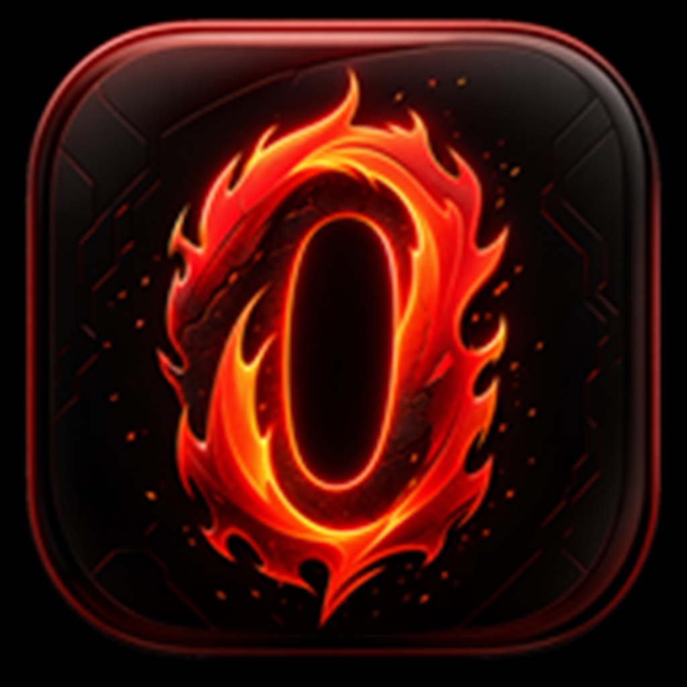

<p align="center">
  
</p>

<h1 align="center">infern0</h1>

<p align="center">
  The Cyanide project, rebuilt as a focused iOS tweak runner and system toolbox.
</p>

<p align="center">
  <a href="https://github.com/Nnnnnnn274/Infern0/releases">
    
  </a>
  
  
  <a href="LICENSE">
    
  </a>
</p>

<p align="center">
  <a href="https://github.com/Nnnnnnn274/Infern0/releases"><strong>Download</strong></a>
  &middot;
  <a href="https://github.com/Nnnnnnn274/Infern0/issues/new?template=bug_report.yml">Report a bug</a>
  &middot;
  <a href="https://github.com/Nnnnnnn274/Infern0/issues/new?template=feature_request.yml">Request a feature</a>
  &middot;
  <a href="https://discord.gg/fx3xvuUyj">Discord</a>
</p>

---

## About

**infern0** is the active continuation of Cyanide, maintained by
[@Nnnnnnn274](https://github.com/Nnnnnnn274). It uses the DarkSword kernel
read/write foundation and RemoteCall to configure and run supported tweaks from
a sideloaded app.

infern0 is not a traditional jailbreak. Most visual changes are live,
session-scoped SpringBoard patches. Some tools deliberately modify persistent
files; those tools are marked with stronger warnings and restoration guidance
inside the app.

> [!IMPORTANT]
> infern0 is experimental system software. A tweak can crash SpringBoard,
> disturb a layout, partially apply, or stop working after an iOS update. Read
> the package warning, keep backups, and test responsibly.

## What's new in 4.0.0

Version 4 reorganizes the app around five purpose-built tabs:

| Tab | Purpose |
| --- | --- |
| **Home** | Current exploit and package status, quick actions, release information, and shortcuts |
| **Packages** | Browse, search, configure, queue, install, refresh, or remove tweaks; manage Sources from the tray button |
| **Tools** | Direct utilities that run without behaving like installed packages |
| **Activity** | A shareable record of exploit, apply, cleanup, and tool output |
| **Settings** | Tweak controls, grouped configuration, interface choices, quick actions, and project information |

The interface is now consistent across the Home screen, package browser,
sources, queue, tools, activity log, settings, dialogs, controls, and tab bar.
Five complete interface styles are included:

- **Classic Ember** - the default infern0 interface and original fiery design;
- **Calm Crimson** - a softer, polished red alternative;
- **Midnight Rose** - a dark rose variant;
- **fr0st** - a cool blue style;
- **Minecraft** - a block-inspired green and earth-tone style.

Classic Ember is the default app icon. Modern, Midnight Rose, fr0st, and
Minecraft alternate icons are also included.
The selected icon is also used by the Home banner, so the app's identity stays
in sync with the chosen style.

Other 4.0 improvements include:

- a package queue with visible install, refresh, removal, and cleanup progress;
- user-managed Sources for community package feeds;
- reorganized settings sections instead of one long tweak list;
- clearer installed, configured, pending, and session-applied states;
- dedicated tool and activity views;
- safer cleanup paths and stronger warnings around persistent changes;
- an Experimental Tweaks switch that gates selected early-beta runtime paths.

## Current package catalog

This list reflects the packages retained by the current 4.0 catalog. Packages
from user-added Sources can appear alongside them when their metadata and
requirements are supported.

### Home Screen and SpringBoard

| Package | What it does |
| --- | --- |
| **SBCustomizer** | Configures the Home Screen grid, labels, dock icon count, and supported iPad-style Dock behavior |
| **Home Layout Extras** | Adds layout padding and per-icon scaling controls |
| **Gravity Lite** | Adds a gravity-style Home Screen icon effect |
| **App Switcher Grid** | Rearranges the app switcher into a grid |
| **QuickLoader** | Loads local JavaScript tweaks and exposes generated settings for their parameters |
| **Disable App Library** | Removes the App Library page |
| **Disable Icon Fly-In** | Skips the icon entrance animation |
| **Zero Wake Animation** | Removes the display wake fade |
| **Zero Backlight Fade** | Removes the lock and unlock backlight fade |
| **Double-Tap to Lock** | Locks the device when the empty wallpaper is double-tapped |
| **Drag Coefficient** | Changes the SpringBoard UIKit animation-speed multiplier |
| **Hide Home Bar** | Hides or restores the Home indicator using a persistent system-asset change |

### Status Bar and notifications

| Package | What it does |
| --- | --- |
| **StatBar** | Shows battery temperature and free RAM in a live status-bar overlay |
| **NSBar** | Shows real-time download and upload speeds |
| **NiceBar Lite** | Adds configurable text, date, network, battery, storage, and system-information labels |
| **Axon Lite** | Groups visible Notification Center requests by app |

### Themes and wallpapers

| Package | What it does |
| --- | --- |
| **Infern0 Themer** | Applies infern0's built-in icon-theming controls |
| **SnowBoard Lite** | Imports and applies local SnowBoard/IconBundles-style themes |
| **LiveWP** | Runs a video wallpaper or an up-to-eight-image Mood Wallpaper session |
| **Lara Font Manager** | Browses, imports, previews, applies, and manages supported fonts and emoji packs |

### System tools

| Package | What it does |
| --- | --- |
| **Powercuff** | Applies synthetic thermal pressure to underclock the CPU and GPU until reboot |
| **Location Simulator** | Sets or restores a static CoreLocation simulation point through Apple Maps |
| **Watch Pairing Override** | Edits the local watchOS pairing compatibility range, with a backup |
| **Call Recording Sound** | Replaces or restores CallServices disclosure audio files; users are responsible for applicable consent laws |
| **OTA Updates** | Disables or re-enables OTA-related launchd jobs |
| **AMFI Bypass Test** | Tests and verifies the existing process-scoped AMFI patch |
| **Lara VFS File Manager** | Provides VFS, sandbox, and hybrid file browsing plus advanced file operations |
| **Lara Settings** | Manages Lara offsets, VFS preferences, logs, and integration information |

## Beta and compatibility-sensitive packages

These packages are also in the current catalog, but depend heavily on private
iOS behavior or are intentionally limited in scope. The first three require
**Settings > Experimental Tweaks** before their runtime path can be applied.
Availability does not guarantee that a package works on every supported device
or OS build.

| Package | Current scope | Access |
| --- | --- | --- |
| **Signal Readouts** | Numeric cellular RSRP and Wi-Fi signal readouts | Experimental Tweaks required |
| **TypeBanner** | iMessage typing banner below the Dynamic Island | Experimental Tweaks required |
| **Notification Island** | Mirrors incoming banners into a Dynamic Island Live Activity | Experimental Tweaks required |
| **IPA Decryptor (Beta)** | Detects FairPlay encryption and exports only executables already verified as unencrypted | Available; encrypted apps are not decrypted yet |
| **MilkyWay Lite / Dynamic Stage** | Hosts one or two apps in floating, resizable windows | Available beta |
| **FastLockX Lite** | Experimental fast-lock behavior | Available beta |
| **Cylinder Lite** | Home Screen page-transition effects | Available; iOS compatibility varies |
| **Macaron Lite** | Colors the Dock, folders, page indicators, and Search | Available; session visual tweak |
| **FloatingDock XVI Lite** | Uses supported native iPad-style floating Dock behavior on iPhone | Available; private-class compatibility varies |
| **Barmoji** | Adds a pressable emoji button strip to SpringBoard | Available beta; it does not inject into app keyboards |
| **Watch Layout** | Arranges native Home Screen icons in a watch-style layout | Available; session layout |
| **Lock Screen Overlay** | Replaces the stock clock area with a noninteractive glass overlay | Available beta |
| **Vesta Lite** | Adds a right-edge app drawer | Available; session overlay |
| **MagSafe Enabler** | Shows a charging-ring overlay when iOS reports charging | Available; all charging sources can trigger it |
| **Upside Down** | Enables supported upside-down SpringBoard rotation behavior | Available experimental session patch |

The older **Lock Screen Customizer** catalog entry is retired in favor of Lock
Screen Overlay. Several older Control Center and Home Screen experiments were
also retired because their current implementations were incomplete or unsafe.
They are intentionally no longer advertised as working packages.

## Compatibility

The app currently gates tweak execution to:

- iOS/iPadOS **17.0 through 18.7.1**
- iOS/iPadOS **26.0 through 26.0.1**

The kernel issues used by this project, `CVE-2025-43510` and
`CVE-2025-43520`, were fixed in iOS/iPadOS 18.7.2 and 26.1. Later releases are
outside the current exploit window. A19 and M5 devices are not supported.

Compatibility can still vary by device and package inside those ranges. Check
the package description, warnings, and Activity tab before assuming a feature
is safe for a particular setup.

## Install

1. Open the [releases page](https://github.com/Nnnnnnn274/Infern0/releases).
2. Download the current `.ipa` from the desired release.
3. Install it with a normal IPA sideloading or signing tool.
4. Launch infern0 and review the compatibility warning.
5. Configure packages before adding them to the queue.

The 4.0.0 prerelease line is for testing. Expect beta packages and some
device-specific behavior to need further work.

## State and cleanup

infern0 distinguishes between three kinds of changes:

- **Live session tweaks** run through RemoteCall and usually need infern0's
  SpringBoard session to remain active. A respring normally restores stock
  behavior.
- **Saved preferences** survive app relaunches and reboots, then control what
  infern0 recreates during a later session.
- **Persistent changes** write system-accessible files and remain until the
  package's documented restore action is used.

The Activity tab records what infern0 attempted and whether each stage
completed. Save or share that log before restarting the app when reporting a
problem.

## Build from source

Requirements:

- macOS with a compatible Xcode and iPhoneOS SDK;
- Xcode command-line tools;
- `xcbeautify` is optional; the script falls back to raw `xcodebuild` output.

Build an unsigned IPA:

```sh
./scripts/build.sh
```

The script builds the `Infern0` scheme and writes a versioned artifact:

```text
build/Infern0-4.0.0.ipa
```

It also maintains `build/Infern0.ipa` as a link to the latest local build.

Equivalent unsigned Xcode build:

```sh
xcodebuild \
  -project Infern0.xcodeproj \
  -scheme Infern0 \
  -sdk iphoneos \
  -configuration Debug \
  CODE_SIGNING_ALLOWED=NO \
  build
```

Pushes to `main` and `testing` also run the GitHub Actions build and release
workflow. Release history and detailed changes live in
[RELEASE_NOTES.md](RELEASE_NOTES.md).

## Contributing

Bug reports, device testing, documentation fixes, and focused package
improvements are welcome.

Before opening an issue:

1. confirm that the device and OS are in the supported range;
2. reproduce with as few enabled tweaks as possible;
3. use the affected package's cleanup or restore action and try again;
4. attach the Activity log and exact device and iOS information;
5. explain whether the problem happened during apply, refresh, cleanup,
   respring, or reboot.

Use the repository templates to
[report a bug](https://github.com/Nnnnnnn274/Infern0/issues/new?template=bug_report.yml),
[request a feature](https://github.com/Nnnnnnn274/Infern0/issues/new?template=feature_request.yml),
or [vote for a tweak](https://github.com/Nnnnnnn274/Infern0/issues/new?template=tweak_vote.yml).

## Community

- [Discord](https://discord.gg/fx3xvuUyj)
- [Signal support and testing group](https://signal.group/#CjQKIP0pxjc9V52ddCNk--04DosuoQl-vVOsznJfQ4GwlrlxEhCveFhBS8YdNcILpUFt7IqC)
- [GitHub issues](https://github.com/Nnnnnnn274/Infern0/issues)

## Project lineage and credits

infern0 stands on substantial work from the iOS research and tweak
communities:

- [zeroxjf](https://github.com/zeroxjf) created Cyanide and its original
  Installer and Settings direction.
- [opa334](https://github.com/opa334) created
  [darksword-kexploit](https://github.com/opa334/darksword-kexploit), ChOma,
  and XPF.
- [wh1te4ever](https://github.com/wh1te4ever) created
  [darksword-kexploit-fun](https://github.com/wh1te4ever/darksword-kexploit-fun)
  and the RemoteCall foundation used by this project.
- [rooootdev](https://github.com/rooootdev) contributed exploit behavior and
  Lara.
- [kolbicz](https://github.com/kolbicz) contributed DarkSword tweaks, OTA work,
  and the original RemoteCall location-simulation prototype.
- [rpetrich](https://github.com/rpetrich) created Powercuff.
- [Julio Verne](https://github.com/julioverne) created the original Gravity
  tweak.
- [d1y](https://github.com/d1y) published the AGPL-3.0
  [cyanide-ios](https://github.com/d1y/cyanide-ios) sources adapted by several
  ports in this tree.
- [tomt000](https://github.com/tomt000) created Dynamic Stage, whose
  scene-hosting design inspired Dynamic Stage Lite.
- `ezzuldinSt`, `YangJiiii`, `@Little_34306`, `neonmodder123`, and the many
  testers and contributors credited in package descriptions helped shape
  individual tools and ports.

The interface also takes inspiration from classic
[Installer.app](https://github.com/AppTapp/Installer-3) and
[Sileo](https://github.com/Sileo/Sileo).

## License

infern0 is distributed under the
[GNU Affero General Public License v3.0](LICENSE).

Fork it, study it, improve it, and keep covered changes open under the same
license. This project is provided without warranty.

---

<p align="center">
  <strong>infern0 is where Cyanide continues: cleaner, calmer, and moving forward.</strong>
</p>
